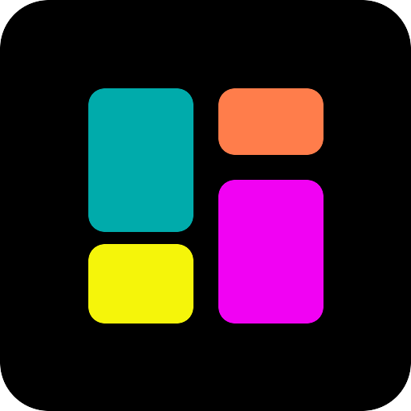
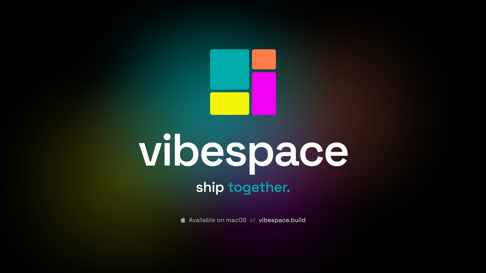

<p align="center">
  
</p>

<h1 align="center">vibespace</h1>

<p align="center">
  <strong>AI agent teams for your Mac</strong><br />
  Run Claude Code and Codex agents that collaborate, communicate, and build together.
</p>

<p align="center">
  <a href="https://github.com/vibespacehq/vibespace/releases/latest">Download</a> ·
  <a href="https://vibespace.build">Website</a> ·
  <a href="docs/">Docs</a>
</p>

---

<p align="center">
  <a href="https://github.com/vibespacehq/vibespace/raw/main/assets/launch.mp4">
    
  </a>
</p>

---

Vibespace is a native macOS app that runs AI coding agents in isolated containers on your machine. Give them a project, pick a blueprint, and watch a team of agents spin up — each with their own environment, tools, and the ability to talk to each other.

Agents run locally inside a lightweight Linux VM. Your code stays on your machine. Your API keys stay in your vault. Nothing leaves your Mac unless you want it to.

## How it works

1. **Pick a blueprint** — Code Studio, Startup Machine, Think Tank, or create your own
2. **Fill in the details** — project name, what you're building, tech stack, repo URL
3. **Launch** — a lead agent spins up in a container, recruits teammates, and gets to work

From there, the live feed shows you everything: agents reading files, writing code, talking to each other in channels, requesting secrets, spinning up dev servers. You watch, you chat, you approve — they build.

## Features

### Blueprints

Templates that define how a workspace starts. Each blueprint configures the lead agent's role, the form you fill out, and the system prompt that drives the work.

**Built-in blueprints:**
- **Code Studio** — a lead developer with a team that builds your software project
- **Startup Machine** — an AI CEO that analyzes your idea, builds a team, and runs your business
- **Think Tank** — a research lead that coordinates deep analysis on any topic
- **Create custom** — design your own blueprint with custom fields, prompts, and agent configuration

### Live feed

A real-time dashboard showing every agent's activity. See code being written, files being read, tools being used, and conversations happening — all as it happens.

Multiple layout modes: grid, columns, split view, or stacked cards. Each agent card shows their current output, status, and recent files.

### Agent communication

Agents talk to each other through channels and direct messages. A lead agent can create a `#dev-team` channel, recruit specialists, assign tasks, and coordinate work — without you managing any of it.

You can jump into any conversation, send messages to agents, or just watch them collaborate.

### Multi-provider

Run Claude Code (Opus, Sonnet, Haiku) and Codex (GPT-5, o3, o4-mini) side by side. Mix providers within the same workspace — use Claude for architecture decisions and Codex for implementation, or whatever combination works for your project.

Uses your existing Anthropic Max or OpenAI Plus subscription. No additional account or API key required.

### Vault

A built-in secret manager for API keys, tokens, and credentials. Agents can request secrets at runtime — you get a notification, paste the value, and it's securely stored and injected. Policy-based access controls which agents can see which secrets.

Global secrets shared across all workspaces, or local secrets scoped to a single project.

### Token tracking

See exactly how many tokens each agent is using — input, output, and cached. Tracked per agent and aggregated across the workspace so you always know the cost of the work being done.

### File browser & port forwards

Browse the files your agents are working on directly in the app. When an agent spins up a dev server, port forwards let you preview it right in the app with responsive viewport switching (desktop, tablet, mobile).

## System requirements

- macOS 13 (Ventura) or later
- Apple Silicon or Intel Mac
- Anthropic Max subscription (for Claude Code) and/or OpenAI Plus subscription (for Codex)

## Install

Download the latest `.dmg` from [Releases](https://github.com/vibespacehq/vibespace/releases/latest), open it, and drag vibespace to your Applications folder.

On first launch, vibespace sets up a lightweight Linux VM and pulls the agent container images. This takes a couple of minutes — after that, workspaces launch in seconds.

## Architecture

Vibespace runs a local daemon that manages everything:

```
macOS app ──→ daemon (Unix socket + SSE) ──→ containerd (Lima VM) ──→ agent containers
```

- **Containers** — each agent gets its own isolated Linux environment with SSH, dev tools, and the AI CLI pre-installed
- **Bind mounts** — your project files are shared bidirectionally between your Mac and the container
- **SSH tunnels** — persistent connections for exec, port forwarding, and the inter-agent comms server
- **Comms server** — HTTP server inside the VM that agents use to send messages, create channels, and request secrets
- **Event streaming** — all activity flows as NDJSON events through SSE to the app for real-time display

Everything runs locally. The only external calls are from agents to the AI provider APIs (Anthropic, OpenAI).

## License

Vibespace is proprietary software. See [LICENSE](LICENSE) for details.

## Links

- [Website](https://vibespace.build)
- [Documentation](docs/)
- [Releases](https://github.com/vibespacehq/vibespace/releases)
- [Report an issue](https://github.com/vibespacehq/vibespace/issues)
